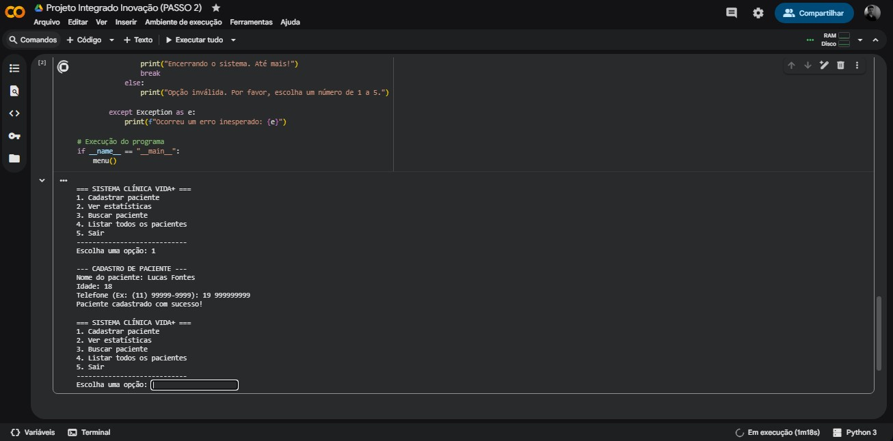
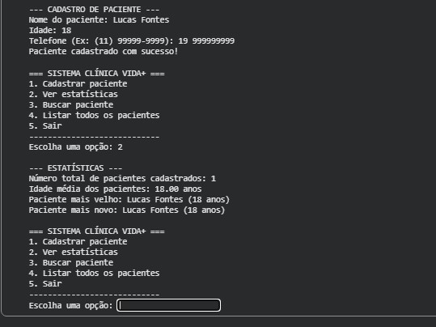
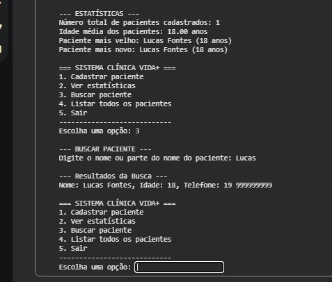
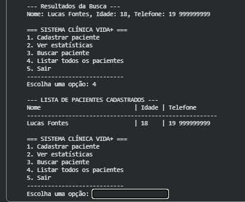
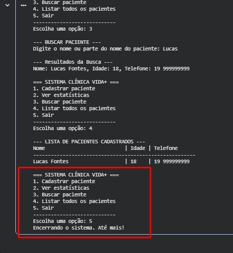

# *Execução do Código* 💻

### *Escolhendo a opção 1- Cadastrar Paciente*

---
### *Escolhendo a opção 2- Ver Estatísticas*

---
### *Escolhendo a opção 3- Buscar Paciente*

---
### *Escolhendo a opção 4- Listar Todos Os Pacientes*

---
### *Escolhendo a opçao 5- Sair*

